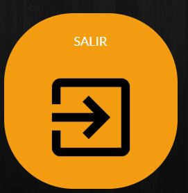
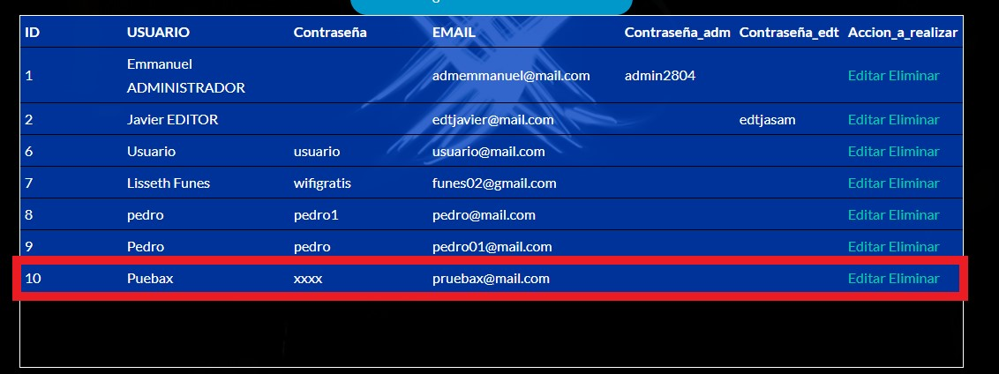
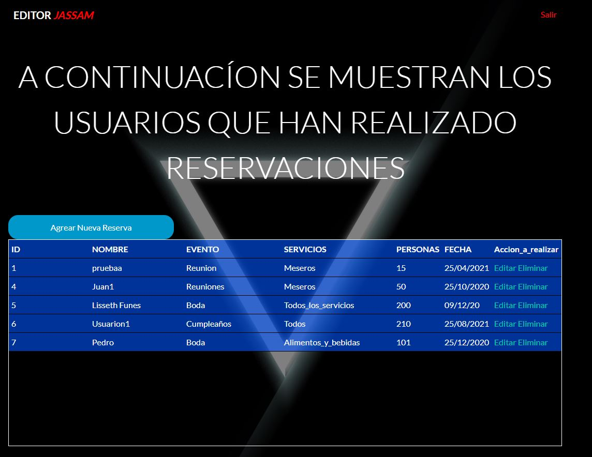

# T5-03 Proyecto Final
## EmmLss Reservations

#### A continuación se muestran las capturas del resultado final de nuestro proyecto.

##### Adquirimos un servicio host de la página, 000webhost.com.

##### Estos son las bases de datos que usamos dentro de está página, cabe recalcar que al tener una cuenta gratuita solo nos permitió crear dos bases de datos.

##### En este apartado es donde añadimos nuestros archivos importados desde nuestra computadora.

##### Accedemos a nuestra página con el siguiente enlace.
[http://emmlssreservations.000webhostapp.com](http://emmlssreservations.000webhostapp.com)

##### Esta es la ventana principal que se muestra al acceder al anlace, es un panel de login.

## Usuario Normal.

##### En caso de no contar con una cuenta lo que se debe hacer es dar clic en "crear" y se cambia el formulario para crear una cuenta nueva.

##### Llenamos los datos que nos pide y despues damos clic en  "registrarse".

##### En seguida nos muestra una ventana donde nos dice el estado de nuestra cuenta nueva creada. En caso de que la cuenta de correo electronico ya esté registrada mostrará lo siguiente. 

##### Se cambia el correo electronico que ya existe y ahora procedemos a crear la cuenta.

##### Nos muestra lo siguiente.

##### Aquí podemos ver como se ha agregado un nuevo registro a nuestra base de datos "Login".

##### Damos clic en "ingresar".

##### Una vez dentro dentro, nos muestra como ventana de inicio o presentación lo siguiente.

##### Aquí como usuario normal solo podemos realizar una acción la cual es reservar, así que para continuar procedemos a dar clic en el botón de "Reservar" ya sea del boton grande o de la barra de navegación. Nos muestra la siguiente ventana.

##### Puede observar las diferentes imagenes que se muestran. El usuario rellana los campos que requiere el formulario y una vez listo da clic en el botón "reservar" y se muestra la siguiente ventana si todo fue realizado con exito.

##### A continuación se muestra como la reserva queda agregada en la base de datos.

##### El usuario puede relizar otra reserva o cerrar sesión y salir de la página con los siguientes botones.

### Administrador
##### Ahora vamos a iniciar sesión con nuestra cuenta de administrador, cabe recalcar que la validación de está ya está por defecto en la base de datos, solo nos queda iniciar sesión con los datos correctos.

##### Si nos hemos logueado correctamente nos muestra una ventana emergente la cual nos indica que hemos iniciado sesión como administrador.

##### Estando dentro del sistema con la cuenta de administrador podemos relaizar dos acciones los cuales son, gestionar los usuarios y las reservas hechas. 

##### Nos manda a una nueva venta la cual podemos ver los usuarios registrados y destacamos el usuario que creamos previamente junto con el correo electronico que ya se encontraba en existencia.

##### Dentro de esta pestaño podemos hacer diferentes acciones, las cuales son, agregar un nuevo usuario, editar o actualizar un usuario existente y eliminarlo. 
##### Damos clic en el botón de agregar nuevo usuario y nos muestra la siguiente ventana en el cual rellenamos los datos requeridos, el id se agrega automaticamente.

##### Una vez listo los datos damos clic en boton de "agregar".

##### Se observa como se ha actualizado la tabla de usuarios con el nuevo registro que hemos agregado.

##### Ahora vamos a editar el mismo registro que hemos creado, damos clic en el boton "editar" y se nos muestra una nueva ventana con los datos del registro.

##### Modificamos lo campos que queramos y damos clic en "Actualizar"

##### Ahora se nos actualiza la tabla de usuarios y se observa como el último registro ha cambiado.

##### Para borrar el registro solo basta con dar clic en el botón de "Eliminar", se actualiza la página y el resgistro desaparece.

##### Como se mencionó anteriormente el administrador puede hacer lo mismo con las reservas, pero en escpecifico ese será para el EDITOR. Si no hay nada más que hacer, dar clic en el botón de "Salir" y nos regresa al formulario de login.
### Editor
##### Colocamos el correo y la contraseña del editor y damos clic en "ingresar"

##### Al igual que con el administrador, al iniciar sesión correctamente, nos muestra una ventana que hemos accedido como Editor.

##### Esta es la pantalla inicial del Editor.

##### Al igual que como el administrador podemos Agregar una nueva reserva, editarla y eliminarla. Vamos agregar una nueva reserva, damos clic en el botón de "Agregar nueva reserva". Nos muestra lo siguiente.

##### Rellenamos todos los campos que nos pide el formulario, cuando todo esté listo damos clic en "agregar".

##### Ahora observamos como en la tabla de reservas se ha agregado un nuevo registro.

#### Para modificar el registro basta con darle clic en "Editar", nos muestra una ventana con todos los campos que podemos modificar del registro seleccionado.

##### Cambiamos los campos que queramos y damos clic en el botón de "Actualizar".

##### Vemos como se ha actualizado el registro en nuestra tabla.

##### Para elimiarlo solo tenemos que dar clic en el boton de "Eliminar" y esté hará lo solicitado.

##### Si no hay nadamas por hacer y se desea salir solo tenemos que dar clic en el enlace rojo "Salir"
### Esté ha sido nuestro sistema de reservaciones Equipo5.

